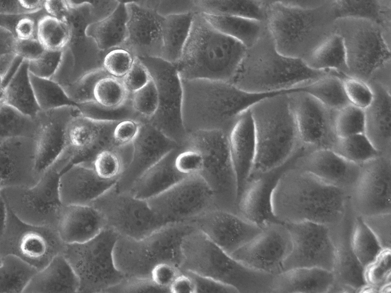

DRAFT VERSION // Finale version will be posted soon

# **celldeath**

A simple python script based on deep learning optimized for classifying cell death in simple transmitted light microscopy images


## Getting Started

celldeath is a deep learning script that trains with light transmitted microscopy
images in order to predict cell death/apoptosis.

We aimed to keep it simple, so anyone can apply it with minimal deep learning knowledge. Parameters for training are already optimized, and will probably lead to a high accuracy. However, we provide some suggestions for fine tunning your training.

### Prerequisites

Please note that for training a deep learning model you need a GPU and a lot of images. If you don't have a GPU available, try any cloud computing provider (AWS, Google Cloud, Azure, etc).

### Installing

For installation, just pip it. We suggest to create a virtual environment, and then install in a specific folder. 

```bash
pip install celldeath -t celldeath
```

### Dependencies

* fastai > 1.4
* image-slicer 0.3.0
* matplotlib > 3.1.1

## Usage

celldeath has three subcommands (*train*, *predict* and *slice*), each one with their options (see below). However, for a simple use, you can follow these next steps. They are optimized for early cell death recognition in transmitted light microscopy images. 

### simple use

Put all your images in a folder called */img*, open your terminal and type (beaware that if you train several times with same images, this previous step has to be done just one time)

```bash
python main.py slice
```

Then type

```bash
python main.py train -labels your_labels -imagenet -predict
```

You have to provide your labels, which must be included in the filename of each image. Default values are *control* and *celldeath*. 

Default values will lead to a high accuracy in your set of images for prediction. Once training is finished, you will find a .txt file under the folder *reports* that includes all training parameters, results on the validation image set, and accuracy on the test set.  


## Subcommands

The next subcommands will give you some more control on preprocessing, training and prediction. Subcommands are:

* **celldeath slice** | Only needed to run once, and only if you wish to slice your images.

* **celldeath train** | Core subcommand for training the neural network.
* **celldeath predict** | One or more images are given and it returns if those cells are undergoing cell death.  

### train

celldeath allows you to train your own images without too much knowledge of deep learning. Be aware that you need at least a few hundreds of images for proper training and prediction. However, with the subcommand *slice* you can split your images in n tiles (usually 4), and hence increase your training performance. The subcommand *train* already has most of the option set up for a decent training, and so you can provide a minimal input (just the path where your images are stored) to get a high accuracy, providing that your images and your experiement are reasonable.

A few recommendations:  

* get as many images as possible.
* try both pretrained (-imagenet) and not pretrained. Pretrainng may be faster, but it is not necessary better though (yes, no cells in imagenet).  
* try augmentation. We set up a minimal augmentation (flip and rotation, minimal changes in light) since too many arguments for this results in a lower performance.  
* batch size (-bs) will depend on you GPU and the size of your images.  
* Always try weight decay. We set it up to 0.01, but also try 0.1.  
* train with many epochs, particularly if you are not using a pretrained network. It may take 40-50 epochs to get a full training.  

#### train subcommand

You can train your own images own images with this poption. Briefly, you should take light transmitted pictures of at least two conditions (control and cell death). Be aware that the more information you feed to the algorythm, the better the ability to train and predict. So, we advise that you should take at least 500 pictures in different biological replicate. Then you can slice them, and use data augmentation to increase you input.  

For image labelling, you have to include in each of your image filenames either the string '*control*' or the string '*celldeath*'. You can change this with the argument -labels, or even include more catgories.   

##### minimal example  

```bash
python main.py train -labels yourlabels -imagenet
```

with this mininmal example, you just need to put your images in the folder *'~/celldeath/split_img/'*, and make sure your filenames contains either *'control'* or *'celldeath'*, acording to your experiments. Defaults will probably take you to a high accuracy. We proved that our script can identify ~99% of celldeath images with minimal changes, in many cases not perceptibles for the human eye. The *-pretrained* option allows you to use a neural network previously trained (with *imagenet*), which may allow to reach a high accuracy in a shorter time. However, in our experience it may not be superior to a plain training, and even a little bit inferior.  

##### extended example (defaults are shown)

```bash
python main.py train -indir /your/path/img -labels yourlabels -model resnet50 -valid_pc 0.2 -l_lr 1e-4 -u_lr 1e-3 -aug -epochs 40 -bs 16 -dropout 0.5 -wd 0.01 -imagenet -test_path your/path/to/test/img
```

##### train options

Short explanations about these options are given below. Some of them may have a huge impact in your training; we suggest you to try small changes in each one of them in order to get your bets trained model.  

command | help |suggestion
---   |  --- | ---
-h, --help |  show this help message and exit
-indir  |  Folder where images are stored. Beaware that default is with splitted images and so default is /split_img
-labels | Give labels of each experimental condition. Labels should be written as in the filenames. Default values are '*control*' and '*celldeath*'.
-model   | Model used for training. Default is ResNet50. Models availbe are resnet34, resnet50, resnet101, and densenet121. | Give a change to deeper models, although it will take longer to train.
-valid_pct |   Validation percentage. Default is 0.2
-l_lr | Lower Limit for learning rate. Default is 1e-4 | You may try 1e-5 or even 1e-6
-u_lr |  Upper limit for learning rate. Default is 1e-3|  
-aug  |Add image augmentation. Default False | Always try it.  
-epochs  | Number of epochs. Default is 50. | Longer training may be beneficial if pretrained is false.
-bs |  Batch Size | Depends on your GPU. Default is 16. 
-dropout |  Drop out to be applied. | Try 0.6-0.25
-wd | Default is 0.01 | Try 0.1 or 0.001
-imagenet | Define if train using Imganet pretrained weights. Default is False.
-test_path | Path where test images are located. Default is 'celldeath/img_split_test'.

After training, a .txt file will be saved in the report folder with accuracy, precision and recall, as well as confusion matrix values. Also, a .csvfile will be saved with each of the the training loss and accuracy epochs values.  

#### predict subcommand  

After training, you can predict the presence of cell death in a set of images by using the *predict* option. Your images should be placed in a subfolder inside the training folder (*indir* from training subcommand).

##### example  

```bash
python main.py predict -path_pred indir/predict/your/img
```

##### predict options

command | help
---   |   ---
-h, --help   |   show this help message and exit
-path_pred |  Path where image/s to predict are stored.

#### slice subcommand

Your training and prediction may improve the more the number of images that you have. If you set up your experiments where cells are confluent enough you may get use of this option. Slice will divide your picture into n tiles, and hence increase the number of images. As far as slicing don't add images without cells you can increase your slicing up to 8 per image.

##### example

```bash
python main.py slice -indir_slicing img/path/here -outdir_slicing your_path/img_split_train -n_tiles 4 -test -test_path your_path/img_split_test -perc_test 0.2
```

##### slice options

command | help
---   |   ---
-h, --help   |   show this help message and exit
-indir_slicing |   Folder where images are stored.
-train_path |   Path where slice images are saved.
-n_tiles | Number of tiles that will be generated. Default is 4; allowed values are 2,4,6 and 8.
-test | Create a random separate set of images for testing. Default is False.
-test_path | Path where images for testing will be stored. Default is img_split_test.
-perc_test | Percentage of iamges that will be used for testing. Default is 0.2.

## Version

0.9.0

## Authors

* **Santiago Miriuka** | <sgmiriuka@gmail.com> | [GitHub](https://github.com/sgmiriuka) | [twitter](https://twitter.com/santiagomiriuka)
* **Alejandro La Greca** | <ale.lagreca@gmail.com>
* **Nelba Pérez** | <nelbap@hotmail.com>

## Reference

https://www.biorxiv.org/content/10.1101/2020.03.22.002253v1

## License

This project is licensed under the MIT License - see the [LICENSE](LICENSE) file for details

## Acknowledgments

* Meli and Shei.
* the fastai team.
